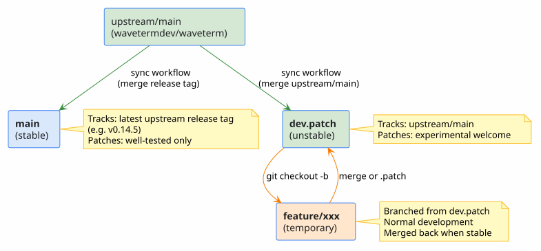
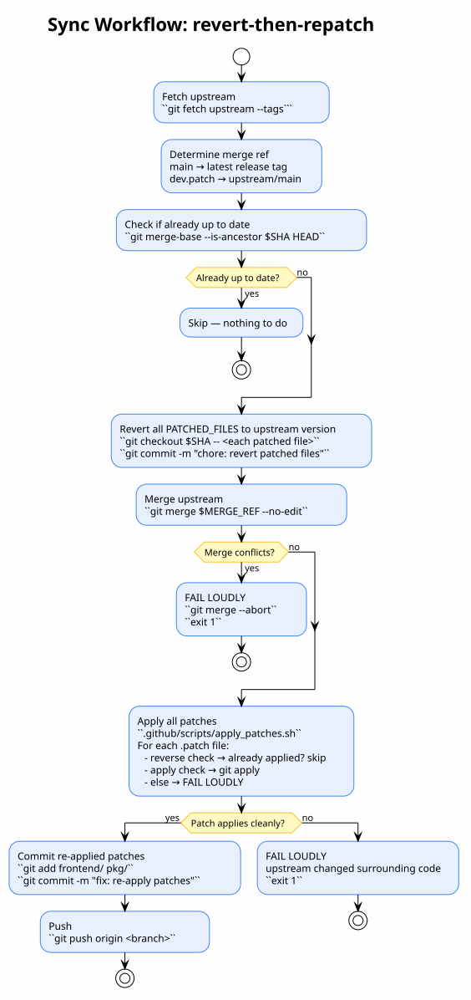
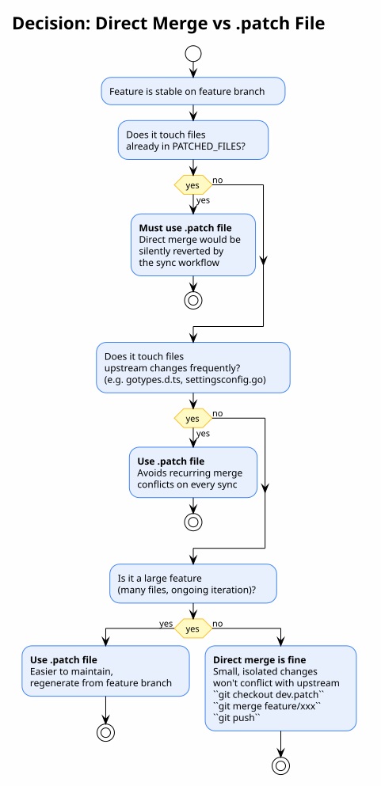
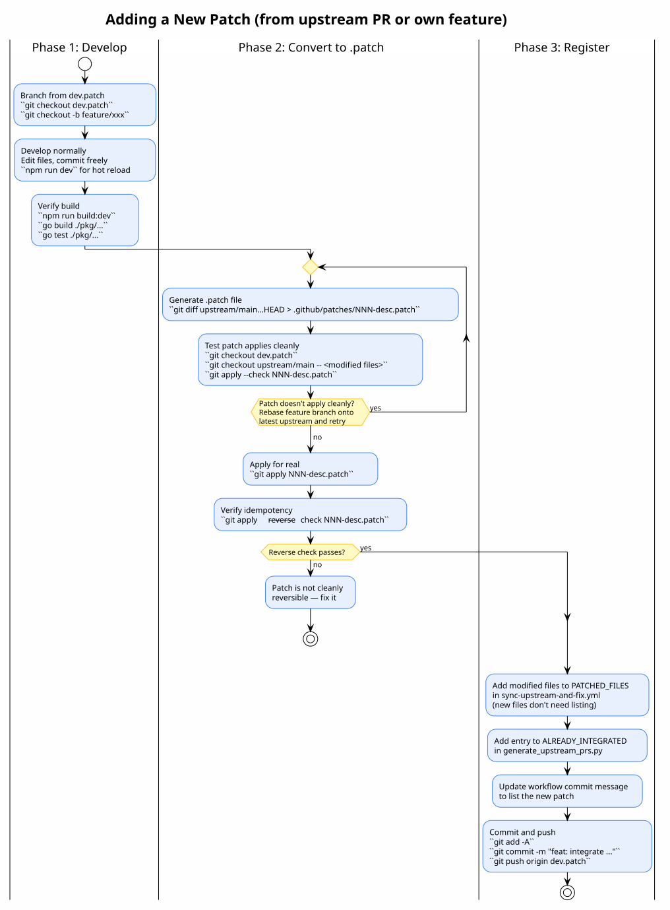

# Fork Development Workflow

This document describes how to develop new features for WaveTerm while keeping
the fork mergeable with upstream. It covers the branch model, the sync
workflow, and the two integration strategies (direct merge vs `.patch` file).

For the mechanical details of the sync workflow, see
[`FORK-STRATEGY.md`](../../.github/FORK-STRATEGY.md). For the PR catalog
system, see [`PR-CATALOG.md`](../../.github/PR-CATALOG.md).

---

## Branch model



| Branch | Tracks | Purpose |
|--------|--------|---------|
| `main` | Latest upstream release tag (e.g. `v0.14.5`) | Stable — well-tested patches only |
| `dev.patch` | `upstream/main` (latest development) | Unstable — experimental patches welcome |
| `feature/*` | Branched from `dev.patch` | Temporary development branches |

The sync workflow runs daily and syncs both `main` and `dev.patch` with
upstream in parallel. Feature branches are never touched by the workflow.

---

## The sync workflow

The `sync-upstream-and-fix.yml` workflow runs daily at 07:00 UTC (or manually)
and keeps both branches up to date with upstream using the
**revert-then-repatch** strategy.



### How it works

For each branch, the workflow:

1. **Fetches upstream** — tags and branches
2. **Checks if already up to date** — skips if upstream has no new commits
3. **Reverts all `PATCHED_FILES`** to upstream's version and commits — this
   removes our custom changes so the merge won't conflict on those files
4. **Merges upstream** — normal `git merge`, no strategy override. If this
   conflicts on non-patched files, the workflow **fails loudly**
5. **Re-applies all patches** via `apply_patches.sh` — loops over
   `.github/patches/*.patch` in order, with idempotency check. If a patch
   doesn't apply cleanly, the workflow **fails loudly**
6. **Commits and pushes** the re-applied patches

### Why revert-then-repatch?

`--strategy-option=theirs` silently lets upstream overwrite custom patches.
The revert-then-repatch approach:

- **Guarantees patches are always re-applied** on the latest upstream code
- **Fails loudly** if upstream changed the surrounding code (`git apply` fails)
- **Fails loudly** if there are conflicts on files we don't patch
- **Never silently drops** a custom change

---

## Developing a new feature

### Phase 1: Develop normally

Branch from `dev.patch` and develop exactly as you normally would — edit
files, commit freely, use `npm run dev` for hot reload. No `.patch` files,
no thinking about the sync workflow.

```bash
git checkout dev.patch
git checkout -b feature/browser-widget

# Develop as usual
npm run dev              # hot reload
go build ./pkg/...       # backend
go test ./pkg/...        # tests

git add -A && git commit -m "wip: scaffolding"
git add -A && git commit -m "feat: wire up backend"
git add -A && git commit -m "fix: handle navigation"
```

### Phase 2: Choose integration strategy

When the feature is stable, decide how to integrate it into `dev.patch`:



**Direct merge** — simple, works for small isolated changes:

```bash
git checkout dev.patch
git merge feature/browser-widget
git push origin dev.patch
```

**`.patch` file** — required for large features or files upstream changes
frequently. The sync workflow then automatically maintains the patch across
upstream merges.

### Phase 3: Convert to `.patch` (if needed)



```bash
# 1. Generate the patch from your feature branch
git diff upstream/main...feature/browser-widget > .github/patches/005-browser-widget.patch

# 2. Test it applies cleanly on dev.patch
git checkout dev.patch
git checkout upstream/main -- <modified files>   # revert to upstream version
git apply --check .github/patches/005-browser-widget.patch

# 3. Apply for real and verify
git apply .github/patches/005-browser-widget.patch
npm run build:dev && go build ./pkg/... && go test ./pkg/...

# 4. Verify idempotency (so apply_patches.sh can detect already-applied state)
git apply --reverse --check .github/patches/005-browser-widget.patch

# 5. Register in maintenance system
#    - Add modified files to PATCHED_FILES in sync-upstream-and-fix.yml
#    - Add entry to ALREADY_INTEGRATED in generate_upstream_prs.py
#    - Update workflow commit message

# 6. Commit and push
git add -A
git commit -m "feat: add browser widget via .patch"
git push origin dev.patch
```

---

## Iterating on an existing patch

Once your feature is a `.patch` file on `dev.patch` and you want to make
further changes:

```bash
# Branch from dev.patch (which already has your patch applied)
git checkout dev.patch
git checkout -b feature/browser-widget-v2

# Develop normally...
git add -A && git commit -m "feat: add tab support"

# When done, regenerate the patch from the updated feature branch
git diff upstream/main...feature/browser-widget-v2 > .github/patches/005-browser-widget.patch

# Test and merge back to dev.patch
git checkout dev.patch
git apply --check .github/patches/005-browser-widget.patch   # should pass
# ... apply, commit, push
```

The old `.patch` file is overwritten with the new version. The sync workflow
will use the updated patch on its next run.

---

## Integrating an upstream PR

When you find an upstream PR you want to integrate (e.g. from the
[PR catalog](../../.github/UPSTREAM-PRS.md)):

```bash
# Fetch the PR branch
git fetch upstream pull/<PR_NUMBER>/head:pr-<PR_NUMBER>

# Generate the patch from the PR's merge base to its head
MERGE_BASE=$(git merge-base pr-<PR_NUMBER> upstream/main)
git diff "$MERGE_BASE"..pr-<PR_NUMBER> > .github/patches/NNN-description.patch

# Test, register, and commit — same as Phase 3 above
```

This is exactly how PR #3443 (file explorer bookmarks) was integrated — see
`004-file-explorer-bookmarks.patch` for a real example.

---

## Diagrams

The PlantUML source files for the diagrams in this document are in the same
directory:

| Diagram | Source | Description |
|---------|--------|-------------|
| Branch Model | `fork-branch-model.puml` | Branch relationships and tracking |
| Sync Workflow | `fork-sync-workflow.puml` | The revert-then-repatch sequence |
| Decision Flow | `fork-decision-flow.puml` | When to use direct merge vs `.patch` |
| Add Patch | `fork-add-patch.puml` | The 3-phase process of adding a new patch |

Render with:

```bash
cd docs/fork-workflow
plantuml-render render *.puml -t svg
```
